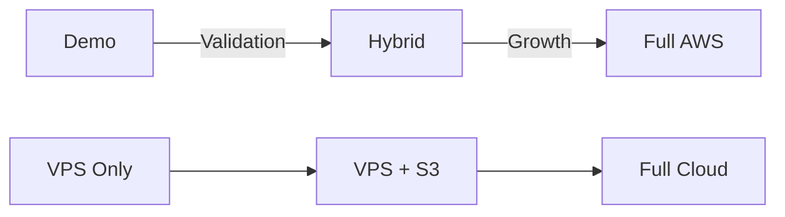

# Whisper MOWD - Demo Deployment Plan

## Overview

This document outlines the two-track approach for Whisper MOWD: a minimal demo for validation and a scale-ready architecture for growth.

## Strategy: Demo First, Scale Ready

### Current Status
- **Built**: Enterprise-ready AWS architecture (not deployed)
- **Need**: Zero-cost demo to validate market interest
- **Goal**: Prove concept, get feedback, secure first customers

### Two-Track Development

#### Track 1: Demo/MVP (Implement Now)
- **Purpose**: Validate market interest
- **Target Users**: 5-50 demo users
- **Monthly Cost**: $0-5
- **Timeline**: 2 weeks

#### Track 2: Production (Ready When Needed)  
- **Purpose**: Scale with paying customers
- **Target Users**: 1000+ users
- **Monthly Cost**: Usage-based
- **Timeline**: Activate when funded

## Demo Architecture

### Simple Architecture
```
[User Browser] → [Cloudflare DNS] → [VPS Server]
                                          ↓
                                    [Nginx Reverse Proxy]
                                          ↓
                                    [FastAPI Application]
                                          ↓
                                    [Whisper Processing]
                                          ↓
                                    [SQLite Database]
                                    [Local File Storage]
```

### Technology Stack
- **Frontend**: Simple HTML/CSS/JS (no framework)
- **Backend**: FastAPI (Python)
- **Database**: SQLite
- **Processing**: Whisper (tiny/base model)
- **Server**: Oracle Cloud Free Tier
- **CDN**: Cloudflare (free tier)

## VPS Options Analysis

### Option 1: Oracle Cloud Free Tier (Recommended)
**Specs**: 
- 4 OCPU (ARM), 24GB RAM, 200GB storage
- 10TB bandwidth/month
- **Cost**: $0/month forever

**Pros**: Best specs, truly free
**Cons**: ARM architecture, setup complexity

### Option 2: Hetzner Cloud
**Specs**: 
- CPX11: 2 vCPU, 2GB RAM, 40GB SSD
- **Cost**: €4.85/month (~$5.50)

**Pros**: Reliable, good performance
**Cons**: Limited RAM for larger models

### Option 3: DigitalOcean
**Specs**: 
- Basic: 1 vCPU, 1GB RAM, 25GB SSD
- **Cost**: $6/month

**Pros**: Easy setup, good documentation
**Cons**: Expensive for specs

## Implementation Plan

### Phase 1: Minimal Demo (Week 1)

#### 1. Simplified API (`app_demo.py`)
```python
# Only 3 endpoints:
POST /upload     # Upload audio file
GET  /status     # Check processing status  
GET  /result     # Get transcription
```

#### 2. Basic Web Interface
- Single page upload form
- Progress indicator
- Results display
- Mobile responsive

#### 3. Processing Pipeline
- Accept audio upload
- Queue for processing
- Run Whisper (tiny model)
- Return results

### Phase 2: Deploy & Test (Week 2)

#### 1. VPS Setup
```bash
# Oracle Cloud Free Tier Setup
- Create VM instance (Ampere A1)
- Install Docker & Docker Compose
- Configure firewall
- Set up domain (optional)
```

#### 2. Security Basics
- HTTPS with Let's Encrypt
- Basic rate limiting
- File size validation
- Input sanitization

#### 3. Monitoring
- Resource usage tracking
- Error logging
- Usage analytics
- Cost monitoring

## Demo Constraints

### Intentional Limitations
| Feature | Demo Limit | Production Capability |
|---------|------------|----------------------|
| File Size | 50MB | 500MB |
| Duration | 5 minutes | 2 hours |
| Model | Tiny/Base | All models |
| Storage | 24 hours | Permanent |
| Users | Password protected | Full auth |
| Daily Uploads | 10 per IP | Unlimited |
| Concurrent | 2 jobs | Auto-scaling |

### Benefits of Constraints
1. **Predictable Costs**: Can't exceed free tier
2. **Clear Upgrade Path**: Shows what paid version offers
3. **Easy to Demo**: Quick processing times
4. **Low Risk**: No surprise bills

## Cost Control & Monitoring

### Automatic Safeguards
```python
# Resource Monitors
- CPU usage > 80% for 5 min → Queue new requests
- Storage > 90% → Delete old files
- RAM > 90% → Reject large files
- Daily limit reached → Show upgrade message
```

### Usage Tracking
```sql
-- Track every request
CREATE TABLE usage_stats (
    id INTEGER PRIMARY KEY,
    ip_address TEXT,
    file_size INTEGER,
    duration_seconds REAL,
    model_used TEXT,
    processing_time REAL,
    created_at TIMESTAMP
);
```

### Cost Projection
| Users/Day | Storage | Bandwidth | VPS Cost | Total |
|-----------|---------|-----------|----------|-------|
| 10 | 1GB | 5GB | $0 | $0 |
| 50 | 5GB | 25GB | $0 | $0 |
| 100 | 10GB | 50GB | $5 | $5 |
| 500 | 50GB | 250GB | $10 | $15 |

## Scaling Triggers

### When to Scale
1. **User Demand**
   - 50+ daily active users
   - 3+ schools interested
   - Processing delays > 5 min

2. **Business Validation**  
   - Letter of intent signed
   - First paying customer
   - Investment secured

3. **Technical Limits**
   - VPS at 80% capacity
   - Need better models
   - Require user accounts

### How to Scale


## Migration Path

### Stage 1: Demo → Hybrid
When: First paying customer
```bash
# Add S3 for storage
# Keep processing on VPS
# Add basic auth
# Enable larger models
Cost: +$10/month
```

### Stage 2: Hybrid → AWS
When: 10+ customers
```bash
# Deploy existing Terraform
# Migrate to Lambda
# Enable auto-scaling
# Full security features
Cost: Usage-based
```

## Success Metrics

### Demo Phase Goals
- [ ] 10 successful demos
- [ ] 3 schools interested  
- [ ] 1 letter of intent
- [ ] <30 sec processing for 2-min audio
- [ ] 99% uptime
- [ ] $0 infrastructure cost

### Feedback to Collect
1. Transcription accuracy
2. Processing speed acceptable?
3. Missing features
4. Pricing expectations
5. Integration needs

## File Structure

```
whisper-mowd-demo/
├── app_demo.py          # Simplified FastAPI
├── templates/
│   └── index.html       # Upload interface
├── static/
│   ├── style.css        # Simple styling
│   └── app.js           # Progress tracking
├── docker-compose.yml   # Easy deployment
├── Dockerfile          # Container config
├── requirements-demo.txt # Minimal deps
├── .env.demo           # Demo config
└── deploy.sh           # One-click deploy
```

## Quick Start Commands

### Local Development
```bash
# Create virtual environment
python -m venv venv
source venv/bin/activate

# Install minimal requirements  
pip install fastapi uvicorn python-multipart faster-whisper

# Run demo
uvicorn app_demo:app --reload
```

### Deploy to VPS
```bash
# SSH to server
ssh ubuntu@your-vps-ip

# Clone and deploy
git clone https://github.com/you/whisper-demo
cd whisper-demo
docker-compose up -d
```

## Risk Mitigation

### Technical Risks
- **Model too slow**: Use tiny model, limit duration
- **Out of memory**: Queue requests, set limits
- **Disk full**: Auto-cleanup, monitoring alerts

### Business Risks  
- **No interest**: Minimal investment, easy pivot
- **Too much interest**: Clear upgrade path ready
- **Competition**: Move fast, focus on education

## Next Steps

1. **Week 1**: Build and test locally
2. **Week 2**: Deploy to Oracle Cloud
3. **Week 3**: Demo to 5 schools
4. **Week 4**: Iterate based on feedback
5. **Month 2**: Scale if validated

---

**Document Status**: Active Planning
**Last Updated**: 2025-01-28
**Next Review**: After first demos